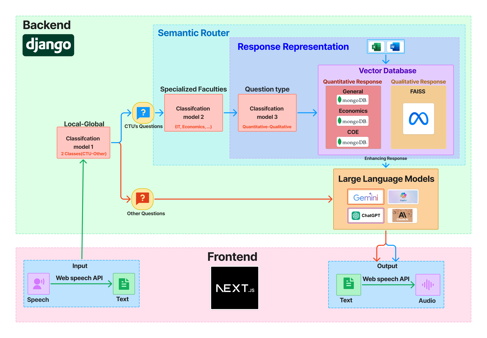
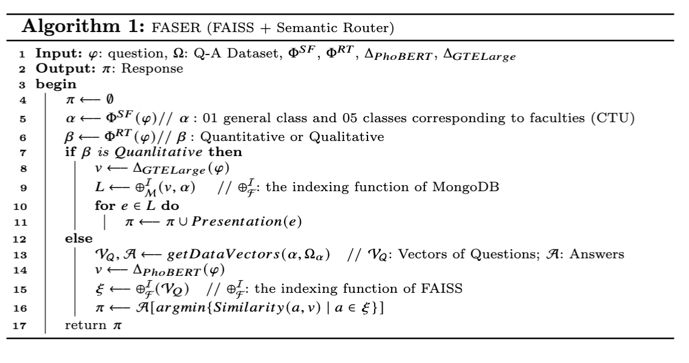
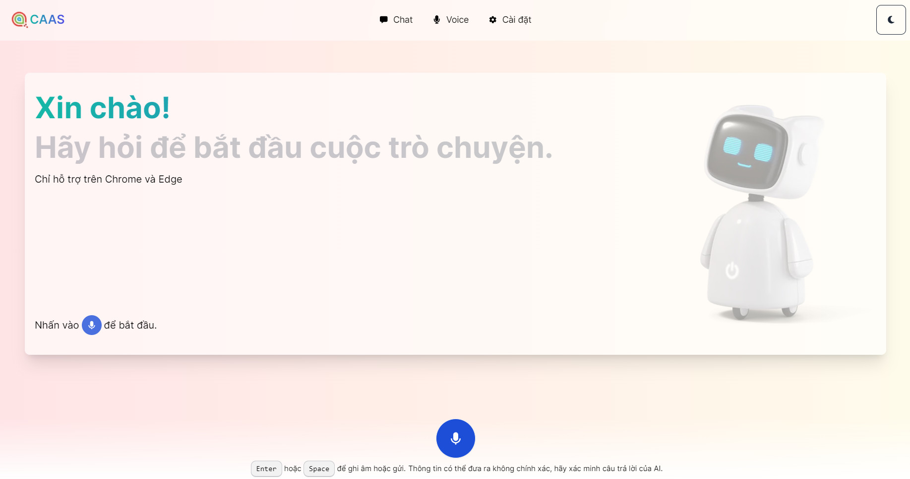
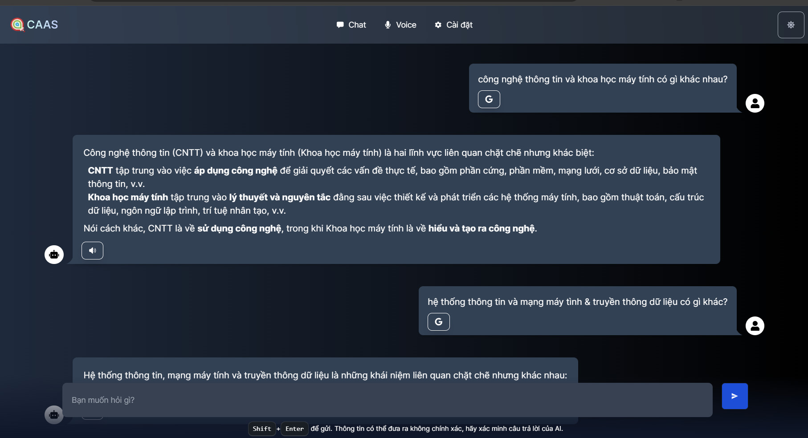
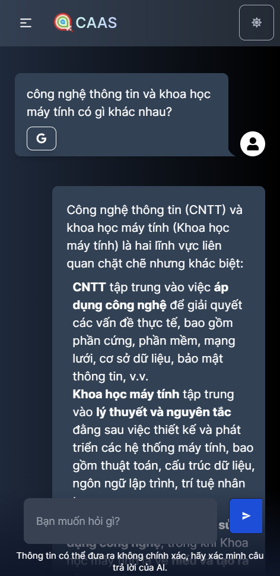
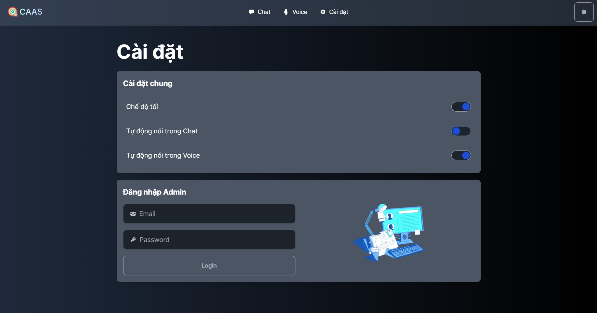

# RACOS: AI-Routed Chat-Voice Admission Consulting Support System

### Thanh Ma, The-Khanh Chau, Phu-An Thai, Tri-Min Tram, Khuong Huynh, and Thanh-Nghi Do (CICT, Can Tho University, Vietnam)
#### {mtthanh,hgkhuong,dtnghi}@ctu.edu.vn, {khanhb2207528,anb2207512,minb2207541}@student.ctu.edu.vn

## Abstract. 
Admission counseling is crucial for guiding parents and students in future planning. Each institution uses a tailored dataset for its counseling system. Leveraging Large Language Models (e.g., ChatGPT, Gemini) and machine learning algorithms, we develope RACOS, an AI-Routed chat-voice framework for Admission COunseling Support at Can Tho University. This framework employs a tiered model to differentiate between general and institution-specific information. General queries are handled by the LLM, while specific inquiries are addressed using customized strategies. We create six response models for five specialized faculties and one for CTU’s general knowledge (a.k.a. a semantic router). The system first performs binary classification, then uses major-specific models for detailed responses. Our experiments showed 99.32% accuracy for the first tier and 99.87% for the second tier. We also develop a web application for model deployment.

## Keywords: 
Support Admissions · Artificial Intelligence · Chat-Voice · Speech Recognition· Text Classification · RAG

## Technologies Used:
- Python 3.10.x
- Django 4.2
- Next.js
- React

## Framework:

## Algorithm:

## Overall Time Complexity:

 For Qualitative Questions:

    • The dominant operations are embedding generation (O(d)) and MongoDB retrieval (O(log n)), making the complexity for qualitative questions approximately O(d + log n + |L|), where |L| is the number of retrieved entities.

 For Quantitative Questions:

    • The embedding generation takes O(d), retrieving vectors has complexity O(m), and FAISS indexing search takes O(log n), followed by a similarity check that takes O(k). Thus, the overall complexity is approximately O(d + m + log n + k).

Key Factors:

    • d: Dimensionality of the embeddings (depends on the embedding models like GTE Large, PhoBERT). 
    • n: Number of indexed vectors/entities. 
    • m: Size of the dataset in terms of question-answer pairs. 
    • k: Number of nearest neighbors returned by FAISS for similarity comparison 

The complexity is mostly logarithmic in terms of data size for retrievals (via MongoDB or FAISS) and linear with respect to the embedding dimension. The final complexity can be seen as a combination of these components, reflecting a balance between indexing efficiency and embedding generation. 

The complexity of the algorithm depends on several key operations: 
    • For qualitative questions, the dominant operations are embedding generation (O(d), where d is the embedding dimension), MongoDB retrieval (O(log n), where n is the number of indexed entities), and iterating over the result set (O(|L|), with |L| being the size of the retrieved list). 
    • For quantitative questions, embedding generation (O(d)), dataset retrieval (O(m), where m is the dataset size), FAISS indexing search (O(log n)), and similarity checks (O(k), with k being the number of nearest neighbors) dominate. 

Overall, the algorithm’s complexity is O(d + log n + |L|) for qualitative and O(d + m + log n + k) for quantitative questions.

## Result:

